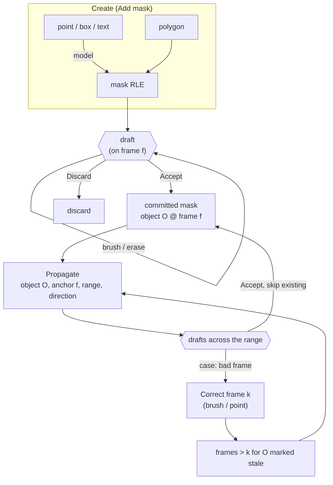
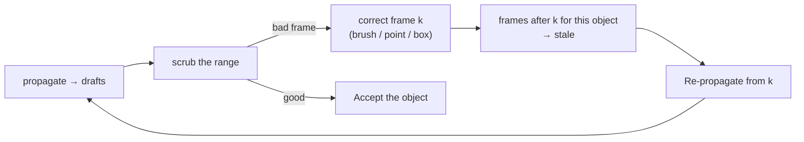

# Mask Interaction Specification

> **Status:** draft for review · **Owner:** platform team · **Last updated:** 2026-09-30
>
> **Scope.** How a user _creates_, _corrects_ and _propagates_ masks in the reviewer. This document is
> the authority on interaction behaviour — tool activation, draft/commit semantics, propagation
> controls and the correction→re-propagation loop. It does **not** cover taxonomy review, project
> packing or export; see `USER_GUIDE.md` and `WORKFLOW_WALKTHROUGH.md` for those.
>
> **Audience.** Whoever implements or extends the mask tools (`Workspace.tsx`, `Toolbar.tsx`,
> `lib/samApi.ts`, `backend/src/api/routes/*`).

---

## Table of contents

1. [Scope and goals](#1-scope-and-goals)
2. [The six principles](#2-the-six-principles)
3. [The pipeline](#3-the-pipeline)
4. [Tools](#4-tools)
5. [Selection and identity](#5-selection-and-identity)
6. [Drafts, undo, commit](#6-drafts-undo-commit)
7. [Propagation](#7-propagation)
8. [The refinement loop](#8-the-refinement-loop)
9. [Visual language](#9-visual-language)
10. [Keyboard map](#10-keyboard-map)
11. [Empty, error and edge cases](#11-empty-error-and-edge-cases)
12. [Acceptance criteria](#12-acceptance-criteria)
13. [Mapping to the current codebase](#13-mapping-to-the-current-codebase)
14. [Open decisions](#14-open-decisions)
15. [References](#15-references)

---

## 1. Scope and goals

**In scope**

- Creating a mask on one frame from a **point**, **box**, **text**, **polygon** or **brush** prompt.
- Correcting an existing mask on one frame.
- Propagating one object's mask across a frame range, in one or both directions.
- Correcting a propagated result and propagating again.

**Goals**

| #   | Goal                                                   | How we know we met it                                                                |
| --- | ------------------------------------------------------ | ------------------------------------------------------------------------------------ |
| G1  | A new user creates a correct mask without reading docs | First-session test: hand over the app, ask for "a mask on the shark", no verbal help |
| G2  | The user never wonders what a gesture will do          | Every gesture has exactly one meaning (P1)                                           |
| G3  | The user never loses work silently                     | Uncommitted drafts are visible and recoverable (§6)                                  |
| G4  | Automated output never silently becomes ground truth   | Model results are drafts until committed (§6)                                        |
| G5  | Correcting one frame is cheap, not a re-do of the clip | Correction invalidates only downstream frames, and only for that object (§8)         |

**Non-goals.** Multi-user concurrent editing of one clip; training; multi-object GPU batching within a
single propagation call (we propagate one object per job, §7.6).

---

## 2. The six principles

These are the rules used to _decide_ whether a proposed interaction is acceptable. Any new feature has
to pass all six.

### P1 — One gesture, one meaning

A click must never mean two things depending on hidden state.

- ✅ Clicking an object with the **point** tool segments _that object_.
- ❌ The same click sometimes meaning "segment this object" and sometimes "here is an example of a
  class" (the current `/api/sam3/segment` behaviour: clicks become exemplar boxes and the reply is the
  **union of every match**).

**Why it matters:** this is the single largest source of "the tool is broken" reports in annotation
tools. The fix is to make each tool carry one intent and name it accordingly (`Point` = this object,
`Text` = this class).

### P2 — Two nouns, nothing else

The annotation model contains exactly two _things_, and the UI addresses nothing else.

| Noun                | Answers       | Lives in                                               | Instance mode            | Semantic mode           |
| ------------------- | ------------- | ------------------------------------------------------ | ------------------------ | ----------------------- |
| **Object**          | _who / what_  | one row per object: id, label, colour, verdict, origin | a tracklet               | a class                 |
| **Mask on a frame** | _where, when_ | `object × frame → RLE` (the `segmentations` array)     | mask of #12 on frame 118 | class mask on frame 118 |

Everything else is derived from these two, not a third kind of thing:

- **Properties** of one noun — colour, area, score, bbox, verdict, origin.
- **Processes** that read or write them — point, box, text, polygon, brush, propagate, accept.
- **Views** that project them — the tracklet list (objects), the timeline (masks per object per frame).

Every gesture therefore resolves to one of exactly two outcomes: it changes the geometry of the
**selected object on this frame**, or it **creates a new object** (which starts with geometry on this
frame). There is no third outcome — no mask that belongs to nobody, and no object with no mask
anywhere.

**Corollary:** a prompt with no object selected creates exactly one new object.

**Where this shows up in our code.** Today's `draft: RawRle | null` in `Workspace.tsx` _is_ a third
thing: a mask with no declared owner. That is why the toolbar needs `canEdit` / `canPropagate` guards,
and why changing frame or object silently discards the draft. Keying drafts by `(objectId, frame)`
(§6.2) folds them back into noun 2 — "this object's mask on this frame, not yet committed" — and the
guards stop being necessary.

### P3 — Prompt creates, brush/polygon corrects — never mixed

| Phase   | Tools                 |
| ------- | --------------------- |
| Create  | point, box, text      |
| Correct | brush, polygon, erase |

The same physical gesture (dragging) is create-or-correct depending on the phase, so the phase has to
be the _tool selection_, not a hidden mode. Concretely: `Add mask` shows the create tools; `Edit mask`
shows brush/polygon/erase. This is already the shape of `Toolbar.tsx` (`addMask` / `editMask`) — keep it.

### P4 — Everything converges on a mask

Every prompt type compiles down to the _same_ currency: a binary mask encoded as RLE.

```
point  ─┐
box    ─┤
text   ─┼─► mask (RLE) ─► draft ─► accepted mask ─► propagation input
polygon─┤
brush  ─┘
```

**Why this is the load-bearing idea:** it means the propagator has exactly one entry point (an anchor
frame + an anchor mask), and every tool benefits from every downstream feature for free. Box → mask →
propagate, and polygon → mask → propagate, need no special cases. It also means "correct the mask" is
the universal refinement interface: fix the mask however you like, then re-propagate.

### P5 — Model output is a proposal, not an edit

Nothing a model produces is written to the clip until the user commits it. The user may drop or accept
each result. (`P2` protects the user _from the model_; this protects the user _from the model's
mistakes_.)

### P6 — Interruption is cheap, abandonment is not

A run may be cancelled at any time and keeps what it already produced. But nothing may be destroyed
that the user cannot see coming: before a write, show how many frames will be created and how many
existing masks will be overwritten (§7.5).

### Decision checklist

Apply to every new mask-related feature. All six must be "yes".

1. Does the gesture have exactly one meaning, with no hidden mode? (P1)
2. Does it act on the selected object, and is that object's identity unambiguous? (P2)
3. Is it clearly _create_ or clearly _correct_? (P3)
4. Does it emit a mask (RLE) rather than a bespoke data type? (P4)
5. Can its result be reviewed before it is committed? (P5)
6. Can it be cancelled, and is what it will overwrite shown first? (P6)

A feature that fails any of these is either redesigned, or demoted to a secondary path (e.g. a
keyboard-only modifier) so it cannot confuse the primary flow.

---

## 3. The pipeline



Two invariants:

- **A draft is always on one frame.** There is no multi-frame draft except a propagation run.
- **Accept is the only writer.** `draft → clip` and `propRun → clip` are the only two paths that
  mutate the annotation.

---

## 4. Tools

| Tool        | Input                         | Result                   | Creates object?        | Notes                                                                   |
| ----------- | ----------------------------- | ------------------------ | ---------------------- | ----------------------------------------------------------------------- |
| **Point**   | click on an object            | mask of that object      | yes, if none selected  | Shift+click = negative point                                            |
| **Box**     | drag a rectangle              | mask inside the box      | yes, if none selected  | same result slot as point; the two combine                              |
| **Text**    | noun phrase                   | every matching instance  | yes (one per instance) | semantic mode: a union mask is correct; instance mode: N objects (§4.3) |
| **Polygon** | click vertices, close         | polygon → mask           | yes, if none selected  | model-free fallback                                                     |
| **Brush**   | drag to paint                 | edits the draft in place | no                     | corrects, never creates the object                                      |
| **Erase**   | brush with paint mode = erase | subtracts from the draft | no                     | not a separate tool; a paint-mode toggle                                |

### 4.1 Point

- **Gesture:** single click on the object. The mask appears where the cursor is.
- **Meaning:** "segment _this_ object" — never "here is an example of a class".
- **Refinement:** each further click re-runs the model with all clicks so far, and feeds the previous
  mask back as a mask prompt (iterative refinement). Debounce ~250 ms so a fast clicker does not
  queue five runs.
- **Negative points:** Shift+click excludes. No visible positive/negative toggle — a mode the user
  forgot they were in is worse than a modifier they only need occasionally.
- **Feedback:** the previous mask dims slightly while a new result is pending, so the user can see
  something is recomputing rather than assuming the click was ignored.
- **Empty result:** keep the draft as-is and show "nothing found at this point" — never silently clear
  existing work.
- **Implementation note (blocking):** this is a _different_ SAM 3 code path from text/box. In the
  reference implementation points only exist in the interactive image predictor
  (`Sam3Image.predict_inst`, requiring `enable_inst_interactivity=True`) and in the tracker
  (`add_tracker_new_points`, which requires an `obj_id`); `Sam3Processor` itself accepts **boxes and
  text only**. See §14/D1.

### 4.2 Box

- **Gesture:** press, drag, release. Minimum 6 px per side — anything smaller is treated as a click
  (point tool) so a stray press cannot create a degenerate box.
- **Meaning:** "the object inside this box".
- **Combines with points:** a box plus clicks in the same session is one prompt submitted together,
  which is how a user says "this object here, but not that part".
- **Feedback:** the rectangle stays visible while the result is pending, then collapses into the mask.

### 4.3 Text

- **Gesture:** type a noun phrase (`shark`, `red car`, `surgical tool`), submit.
- **Result:** _all_ instances of that concept on this frame.
- **Semantic mode:** the union of instances **is** the class mask — accept it directly.
- **Instance mode:** a union is not sufficient, because one tracklet must be one object. Options are
  ordered by preference:
    1. **Split (preferred):** return N instance masks; show "4 instances found — Accept all as 4
       objects / pick one". Accept-all creates N objects.
    2. **Semantic-only (fallback):** in instance mode, text is a _find_ gesture that returns candidates
       to pick from, and creating a tracklet still requires picking one instance.
    - Never create one tracklet whose mask contains several disjoint objects.
- **Guard:** the text tool never overwrites an existing mask. Its output is always a new draft.

### 4.4 Polygon

- **Gesture:** click vertices; **Enter** or double-click closes; **Backspace** removes the last vertex;
  **Esc** cancels. Clicking within ~10 px of the first vertex closes it.
- **Meaning:** "this shape" — manual, no model.
- **Why it stays:** it is the only creation tool that works with the model unavailable or wrong
  (occluded objects, unusual geometry, model outages), and it is required for annotating categories
  the text prompt cannot name.
- **Cost it imposes:** it is the slowest tool. Mitigation: it lives in `Add mask` alongside the model
  tools but is never the default (`method` starts as `sam`), and it composes with the draft the same
  way brush does, so a polygon can be finished by brush.

### 4.5 Brush and erase

- **Gesture:** drag to paint; `[` / `]` change size; `X` toggles add/erase.
- **Meaning:** local correction of the current draft.
- **Rule:** a brush stroke composes into the _same_ draft as a model result (`composeRle`), so the
  sequence "text → brush the leftovers → erase the spill" is one draft with one undo history and one
  Accept. This is what makes model output usable rather than merely suggestive.
- **Never creates an object.** With no draft and no selection, brushing starts a _new_ object's draft
  (P2) — but the object is created by Accept, not by the stroke.

---

## 5. Selection and identity

| Situation                                     | Behaviour                                                                                                                  |
| --------------------------------------------- | -------------------------------------------------------------------------------------------------------------------------- |
| User clicks an existing mask (Review tool)    | That mask's object becomes selected                                                                                        |
| User picks a row in the tracklet list         | Same                                                                                                                       |
| A create tool is used with an object selected | The draft attaches to that object; Accept **replaces** its mask on that frame (after a confirmation if it already had one) |
| A create tool is used with nothing selected   | The draft is "new object"; Accept creates the object, asks for nothing else                                                |
| Semantic mode                                 | There is no identity; the draft attaches to the selected class                                                             |
| Multi-select                                  | Exists **only** as a propagation queue (§7.6); it never changes what a create tool targets                                 |

**One selected object at a time in the primary path.** This is deliberate: "which object is this
mask going to?" must never be a question.

---

## 6. Drafts, undo, commit

### 6.1 Draft lifecycle

| Event                     | Behaviour                                                                              |
| ------------------------- | -------------------------------------------------------------------------------------- |
| Prompt returns            | Draft holds the model mask                                                             |
| Brush / polygon / erase   | Composes into the draft; each step is one undo entry (history depth 40)                |
| **Ctrl+Z / Ctrl+Shift+Z** | Undo / redo within the draft                                                           |
| **Accept** (`A`, `Enter`) | Draft → committed mask; tool returns to Review                                         |
| **Discard** (`Esc`)       | Draft dropped; committed mask untouched                                                |
| Tool switch               | Draft is **kept** and restored when the tool returns (it is keyed by `objectId:frame`) |
| Frame change              | Draft is **kept**, not discarded — see 6.2                                             |
| Clip close / export       | Blocked while an uncommitted draft exists                                              |

### 6.2 The frame-change rule (a behaviour change)

Today a draft is dropped when the user navigates away. That is silent data loss and it fails G3.

**Rule:** drafts are stored per frame. When the user leaves a frame with an uncommitted draft:

1. The frame is marked with a **draft indicator** in the timeline strip.
2. The draft is re-loaded if the user returns to that frame.
3. On export or clip close, if drafts remain, the user is asked once: _"3 frames have uncommitted
   masks. Discard them?"_

This is the cheapest possible fix for "where did my mask go?", and it costs one map keyed by frame
instead of one nullable `draft`.

### 6.3 What Accept does to an existing mask

Accept replaces the object's mask on that frame. If a mask already existed there, Accept is a
one-click-confirmable action with the frame count in the label ("Replace mask on this frame"), and it
is a single undo entry. Never a modal dialog.

---

## 7. Propagation

### 7.1 Contract

```ts
propagate({
    objectId, // exactly one object
    anchorFrame, // frame carrying the source mask
    anchorMask, // RLE, bool, same size as the frames
    first,
    last, // inclusive frame range
    direction, // "forward" | "backward" | "both"
    writePolicy, // "skip-existing" | "replace-range"
});
```

The anchor mask may have come from _any_ tool — text, box, point, polygon or brush (P4). The
propagator does not care, and must not.

### 7.2 Anchor

- Default anchor = the current frame, if the object has a mask there.
- If it does not, the anchor is the object's **nearest** frame that has a mask, and the UI says so:
  _"using the mask on frame 118 as the anchor"_.
- Propagate is disabled (with a reason) when the object has no mask at all.

### 7.3 Direction

| Option            | Meaning        | Passes                    |
| ----------------- | -------------- | ------------------------- |
| After (forward)   | anchor → end   | 1                         |
| Before (backward) | anchor → start | 1                         |
| Both              | both ways      | 2: forward, then backward |

Forward runs first so that the frame range the user is looking at is filled soonest, and both passes
share the anchor's memory. The UI must show two progress phases for "Both" — a single bar that jumps
back to 0 % at the halfway point reads as a restart.

### 7.4 Range

- **N frames** (default 10) — the bounded case, always available.
- **To the end of the clip** — the same thing with `last = frameCount - 1`.
- The range is clamped to the backend's `PROPAGATE_MAX_FRAMES` (default 120) **and the UI says so**
  (_"limited to 120 frames per run"_), rather than silently shrinking the request (`propCapped`
  already detects this — surface it instead of just clamping).
- **Chunking (when the range exceeds the cap):** chunks overlap by ≥ 2 frames and each chunk is
  anchored on the previous chunk's last accepted mask. Without the overlap the tracker starts from an
  empty memory bank at every chunk boundary, and quality dips visibly at exactly those frames.
  Chunk boundaries are shown in the timeline as thin ticks.

### 7.5 Write policy

| Policy                      | Behaviour                                                                             |
| --------------------------- | ------------------------------------------------------------------------------------- |
| **Skip existing** (default) | Frames that already have a mask for this object keep it; only empty frames are filled |
| **Replace range**           | Every frame in range is overwritten with the propagated mask                          |

Before the run, the panel shows the consequence: _"will fill 96 frames, skip 14 that already have
masks"_ or _"will overwrite 14 existing masks"_. Nothing is written until Accept.

Empty results (the tracker reports no object) are **never** written as empty masks. They are reported
(_"not found on 6 frames"_) and the object is considered absent there (occlusion / off-screen).

### 7.6 One object per job, many objects as a queue

Masks are propagated **one object at a time**. This bounds GPU memory to one object's memory bank and
keeps every run cancellable.

Selecting several objects does not widen a request; it **enqueues** N jobs.

- Jobs run sequentially (queue depth 1 on the GPU) with a visible queue: `object name · range · state`.
- States: `waiting → running (i/n frames) → done / cancelled / failed`.
- The user can reorder or drop queued jobs, and cancel the running one.
- The queue survives per-object failures: a failed job is marked failed, the rest continue.

### 7.7 Progress, cancellation, locking

- Results **stream in per frame** (the reviewer follows along), rather than one long blocking request.
- **Cancel** keeps everything already produced as drafts; the user accepts or discards.
- While a job runs, the create/correct tools stay usable on the current frame (the user's draft is
  unaffected), but starting a second propagation job is queued, never concurrent.

---

## 8. The refinement loop

This is the answer to _"can we ask the model to propagate again to fix it?"_ — yes, and it is the
primary way tracklets get fixed. Design it as a loop, not a one-shot.

### 8.1 Frame states

Every (object, frame) pair is in exactly one state:

| State      | Meaning                                          | Shown as         |
| ---------- | ------------------------------------------------ | ---------------- |
| `none`     | nothing known                                    | empty timeline   |
| `draft`    | proposed, uncommitted                            | amber            |
| `accepted` | committed, believed correct                      | solid            |
| `stale`    | committed, but a later correction invalidated it | hatched / dimmed |
| `lost`     | tracker reported no object                       | small dash       |

### 8.2 The loop



### 8.3 Mechanics (verified against the SAM 3 reference implementation)

1. **A corrected frame becomes a conditioning frame.** The tracker re-encodes its memory on that frame
   _before_ propagating (`propagate_in_video_preflight(run_mem_encoder=True)`), so the run continues
   from the corrected appearance rather than from the previous prediction.
2. **Stale memory around the correction must be dropped.** The reference tracker does this by default
   (`clear_non_cond_mem_around_input=True`, clearing within ±7 frames of the corrected frame,
   `memory_temporal_stride_for_eval=1`). Skipping it is the single most common reason a correction
   "does not stick": the old appearance keeps being attended to and the mask snaps back a few frames
   later.
3. **Correct 2–3 frames, then re-propagate once.** The tracker attends up to 4 conditioning frames and
   keeps 7 in the memory bank, so three good anchors produce a far better run than the same correction
   applied three times. Expose this: _"correct on f120, f300, f480 → re-propagate forward once"_.
4. **Only the corrected object is re-propagated.** The reference implementation supports re-running
   the tracker for a subset of objects without re-running the detector ("partial propagation"). With
   our one-object-per-job rule this is free.
5. **Downstream only.** Correcting frame _k_ invalidates frames `> k` for that object when
   propagating forward (and `< k` when backward). Frames before _k_ are untouched and keep their state.
6. **Re-run replaces; it does not blend.** A re-propagated range overwrites the stale masks in it.
   Blending two runs across a boundary produces a seam that no one can explain later.

### 8.4 Cost

Re-propagating `[k, last]` costs the same as propagating that range from scratch, because the tracker
is memory-based and there is no cached state for a _different_ conditioning set. That is acceptable:
it is one object over a bounded range, and the alternative (accepting a drifting mask) is worse.

### 8.5 Fallback if the tracker API cannot re-condition

The backend currently targets `transformers>=5` (`Sam3TrackerVideoModel`). Whether that port exposes
re-conditioning and the memory-clear step is **unverified** (§14). If it does not, the equivalent flow
is:

1. Collect the corrected masks for the object (they are all in the annotation already).
2. Start a fresh propagation seeded with the corrected frame(s) as anchors (multi-anchor if supported,
   otherwise the latest correction).
3. Overwrite the stale range.

That achieves most of the benefit with no new tracker capability, at the cost of a fresh session per
refinement.

---

## 9. Visual language

One colour per meaning, everywhere (canvas, list, timeline, buttons). Do not reuse a colour for a
second meaning.

| State / meaning             | Rendering                                                                   |
| --------------------------- | --------------------------------------------------------------------------- |
| Accepted mask               | solid fill, object colour, at `maskOpacity`                                 |
| Draft mask                  | same colour, ~40 % opacity, dashed outline, "Draft — not saved" chip        |
| Stale mask                  | 50 % opacity, diagonal hatch, tooltip _"outdated: frame 118 was corrected"_ |
| Propagated draft (in a run) | object colour, thin animated outline while the run is live                  |
| Selected object             | full opacity + 2 px outline; unselected objects dim to ~60 %                |
| Negative point              | red dot with a minus; positive point = green dot with a plus                |
| Model unavailable           | tool disabled, reason in the tooltip, polygon/brush still enabled           |

**Notice copy.** Every commit notice states _what_, _where_, _with what_, and _how many_:
"Propagated «shark» (#12) from frame 118 over 96 frames (118–213) with SAM 3; skipped 14 frames that
already had a mask." Never a bare "Done".

---

## 10. Keyboard map

Extending the existing shortcuts; new ones are marked **+**.

| Key                                | Action                                                                 |
| ---------------------------------- | ---------------------------------------------------------------------- |
| `V`                                | Review tool                                                            |
| `A`                                | Add mask (create)                                                      |
| `E`                                | Edit mask (correct)                                                    |
| `T`                                | Propagate                                                              |
| `1` `2` `3`                        | Create method: point / box / text **+**; `4` polygon (kept, §4.4)      |
| `X`                                | Toggle add / erase paint mode                                          |
| `[` `]`                            | Brush size                                                             |
| `Enter` / `A`                      | Accept draft                                                           |
| `Esc`                              | Discard draft / cancel polygon                                         |
| `Ctrl+Z` / `Ctrl+Shift+Z`          | Undo / redo draft step                                                 |
| `Shift`+click                      | Negative point **+**                                                   |
| `Space`                            | Play / pause                                                           |
| `,` `.`                            | Previous / next frame                                                  |
| `Ctrl+Enter` **+**                 | Re-propagate from the current frame (when the object has stale frames) |
| `Shift`+click a tracklet row **+** | Add to the propagation queue                                           |

---

## 11. Empty, error and edge cases

| Case                                   | Required behaviour                                                                                  |
| -------------------------------------- | --------------------------------------------------------------------------------------------------- |
| Model unavailable                      | Create tools disabled with the reason in the tooltip; polygon and brush fully usable; never a modal |
| Prompt finds nothing                   | Keep the draft; inline "nothing found"; never clear existing work                                   |
| Mask smaller than ~0.01 % of the frame | Warn ("that looks like a stray click") but allow Accept                                             |
| Text in instance mode                  | Offer split; if unsupported, say so instead of silently producing a union                           |
| Anchor frame has no mask               | Propagate disabled, reason shown, offer "go to the object's first mask"                             |
| Range exceeds the cap                  | Say so, and offer to queue the next chunk automatically                                             |
| Run cancelled                          | Keep produced drafts; notice says how many frames were kept                                         |
| Run fails mid-way                      | Keep produced drafts, mark the job failed, allow retry from the last good frame                     |
| Frames differ in size inside a window  | Reject with a clear message (the tracker requires uniform size)                                     |
| Two objects overlap on a frame         | No silent resolution: keep both masks, flag the overlap in the reviewer for a human decision        |
| Object removed while a job is queued   | Drop the job with a notice                                                                          |

---

## 12. Acceptance criteria

Written to be testable; each maps to a principle.

**Create**

1. With nothing selected, a box on an object creates exactly one new object, its mask a draft. (P2)
2. A point prompt segments the object under the cursor, **not** every similar-looking object. (P1)
3. In semantic mode, a text prompt's union mask can be accepted as one class mask. (P4)
4. In instance mode, a text prompt returning 4 instances never yields one tracklet containing 4
   objects. (§4.3)
5. A polygon that is closed with Enter produces the same kind of draft as a model result. (P4)

**Correct**

6. `text → brush → erase` is a single draft with one Accept and one undo history. (§4.5)
7. Discarding a draft leaves the committed mask byte-identical. (P5)

**Draft safety**

8. Navigating away from a frame with a draft, then returning, restores the draft. (§6.2)
9. Exporting with an uncommitted draft asks once before proceeding. (§6.2)

**Propagate**

10. The pre-run panel states how many frames will be filled and how many existing masks are affected.
    (P6)
11. Skip-existing leaves a pre-existing mask on frame `f` untouched. (§7.5)
12. Selecting three objects enqueues three jobs; GPU work stays sequential; each job reports its own
    progress and can be cancelled. (§7.6)
13. Cancelling a run keeps the drafts produced so far. (P6)
14. Nothing is written to the clip before Accept. (P5)

**Refine**

15. Correcting frame `k` marks that object's frames `> k` stale and offers "re-propagate from here".
    (§8.3)
16. Re-propagating replaces the stale range; it does not blend with it. (§8.3)
17. A correction that is not followed by a re-propagation persists as a single-frame edit. (P5)

---

## 13. Mapping to the current codebase

| Area                                                      | Now                                                                  | Change                                                                                                                         |
| --------------------------------------------------------- | -------------------------------------------------------------------- | ------------------------------------------------------------------------------------------------------------------------------ |
| `Workspace.tsx` — `draft: RawRle \| null`                 | Single draft, dropped when the frame changes                         | Per-frame draft map keyed by object + frame, with timeline indicators and a leave-guard (§6.2)                                 |
| `Workspace.tsx` — `method: "sam" \| "polygon" \| "brush"` | `sam` = clicks-as-exemplars → union                                  | Split into `point` / `box` / `text` / `polygon` (§4, §14/D1)                                                                   |
| `Workspace.tsx` — `PropagateRun`                          | One run, `propBack` / `propForward`, skip-existing only              | Add `direction`, `toEnd`, `writePolicy`, chunk sequencing, per-frame streaming (§7)                                            |
| `Workspace.tsx` — after `acceptPropagation`               | Fixing a frame is a dead end                                         | Track staleness per (object, frame); add "re-propagate from here" (§8)                                                         |
| `lib/samApi.ts` — `segmentConcept` / `segmentFrame`       | Points become exemplar boxes; union only                             | Add `box`, `pointMode`, and instance-split results; keep the current behaviour available as the _text/example_ path            |
| `lib/maskApi.ts` — `decodeMasks`                          | POSTs `/api/decode/masks`                                            | `lib/rle.ts` already decodes RLE in TS; the endpoint can be retired and drafts decoded locally (removes a round-trip per edit) |
| `api/routes/sam3.py`                                      | `points` + `text` only                                               | Add `box`, and an instance list in the response (§4.3)                                                                         |
| `api/routes/propagate.py`                                 | One blocking request, `backward`/`forward`, ≤ `PROPAGATE_MAX_FRAMES` | Add `to_end`, streaming progress, job id + cancel; or a resident video session per clip (§14/D3)                               |
| `Toolbar.tsx`                                             | `addMask` / `editMask` / `propagate` / `review`                      | Unchanged shape; add the `point`/`box`/`text`/`polygon` method row and the queue indicator                                     |

---

## 14. Open decisions

**D1 — Point prompt semantics (blocking §4.1).**
"Click = this object" needs the interactive predictor path
(`Sam3Image.predict_inst` with `enable_inst_interactivity=True`), which is _not_ the path
`/api/sam3/segment` uses today. Either port that path, or keep clicks as exemplars and rename the tool
`Example` (accepting that it returns a union). **Recommendation:** port it — "Example" as the only
click behaviour is what makes the create tools feel random.

**D2 — Text in instance mode.**
Split into N instances now, or restrict the text tool to semantic projects and use box/point for
instance objects in the meantime. **Recommendation:** restrict now, split next; do not ship a union in
instance mode.

**D3 — Propagation transport.**
Chunked windows with ≥2 frames of overlap (ships on the current per-request design, small boundary
drift), or a resident video session per clip (`start_session` + `offload_video_to_cpu`, one continuous
run, no re-upload). **Recommendation:** resident session — it also makes "to the end" and cancel
straightforward, and removes the per-chunk re-upload of frames.

**D4 — Re-conditioning support (blocking §8.5).**
Confirm whether the installed `transformers>=5` tracker exposes conditioning-frame insertion and the
memory clear. Currently unverifiable: no environment on this machine has `transformers>=5` with torch,
so `/api/sam3/*` and `/api/propagate` have never actually executed. **Action:** smoke-test
`/api/sam3/status` and `/api/propagate` on a 3-frame clip before building UI on top of either.

**D5 — Per-frame accept in review.**
The reviewer commits verdicts per tracklet today. Add per-frame mask accept/reject only if the
propagation drafts prove to be the bottleneck. **Recommendation:** defer.

---

## 15. References

Design decisions in §4.1, §7 and §8 are grounded in the SAM 3 reference implementation
(`C:\Users\WYK\Documents\HKUST\MPhil\Research\sam3`, read 2026-09-30):

| Topic                                                       | Location                                                                                                                                                                  |
| ----------------------------------------------------------- | ------------------------------------------------------------------------------------------------------------------------------------------------------------------------- |
| Image prompts: text and **boxes only**                      | `sam3/model/sam3_image_processor.py` (`set_text_prompt`, `add_geometric_prompt`)                                                                                          |
| Point/box/mask prompting (interactive predictor)            | `sam3/model/sam1_task_predictor.py` (`SAM3InteractiveImagePredictor.predict`, `multimask_output`, `mask_input`)                                                           |
| Interactive entry point                                     | `sam3/model/sam3_image.py` (`predict_inst`, `predict_inst_batch`)                                                                                                         |
| Correction becomes a conditioning frame                     | `sam3/model/sam3_tracking_predictor.py` (`add_new_points_or_box`, `add_new_mask`, `propagate_in_video_preflight`)                                                         |
| Stale-memory clear around a correction                      | `sam3/model/sam3_tracking_predictor.py` (`_clear_non_cond_mem_around_input`); enabled by `clear_non_cond_mem_around_input=True` in `sam3/model_builder.py::build_tracker` |
| Partial (per-object) re-propagation                         | `sam3/model/sam3_video_inference.py` (`parse_action_history_for_propagation` → `propagation_partial`)                                                                     |
| Mask as the propagation input, used verbatim                | `sam3/model/sam3_video_inference.py::add_tracker_new_mask`                                                                                                                |
| Memory bank sizing (7 frames, ≤4 conditioning in attention) | `sam3/model_builder.py::build_tracker`, `sam3/model/sam3_tracker_base.py`                                                                                                 |
