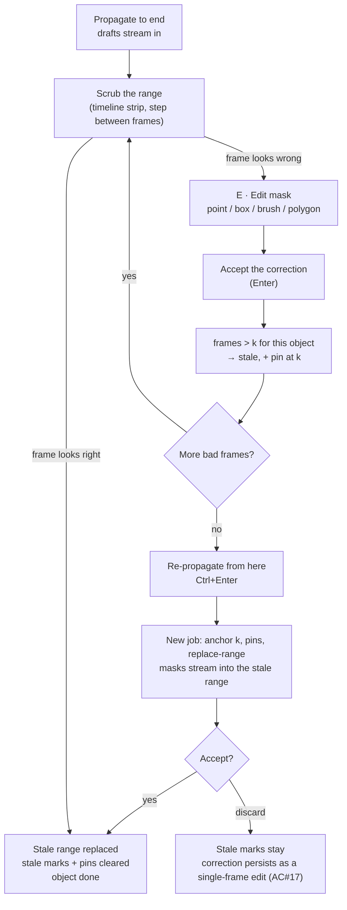

# Propagation Refinement Plan — Correction → Stale → Re-propagate

> **Status:** awaiting sign-off · **Created:** 2026-09-30
> **Companion:** `docs/MASK_INTERACTION_SPEC.md` §8 (the refinement loop), §6.2 (drafts), §7.5 (write policy), §10 (keyboard), §12 AC#15–17.
> **Builds on:** `docs/IMPLEMENTATION_PLAN.md` §3 (windowed propagation) — the transport described there is already implemented, so this plan adds only what §8 needs.

---

## 0. The session question — answered first

The question was: _does SAM 3 need to keep a session alive so a correction can be re-conditioned, or can we just
start a new session and pass the existing masks as prompts?_

**Answer: the second one, and that is already how the code works.** There is no long-lived session to keep, and
none is needed.

| Option                                                    | How it would work                                                                                                                                     | Verdict                                                                                                                                                                                                                                                                                                             |
| --------------------------------------------------------- | ----------------------------------------------------------------------------------------------------------------------------------------------------- | ------------------------------------------------------------------------------------------------------------------------------------------------------------------------------------------------------------------------------------------------------------------------------------------------------------------- |
| **A. Resident session per clip**                          | One `start_session` for the whole clip, corrections added with `add_mask` into the _same_ session, then re-propagate                                  | ❌ Rejected. Needs the clip resident in tracker memory (the old GPU-OOM problem), needs `_clear_non_cond_mem_around_input` to be reachable and correctly configured, and needs per-object partial re-propagation (`parse_action_history_for_propagation`). All three are extra API surface we would have to verify. |
| **B. Fresh session per window, masks as the only prompt** | Each window opens its own session, is conditioned on masks via `add_mask`, propagates, and closes. Re-propagating = the same thing with a new anchor. | ✅ **Chosen — already implemented.**                                                                                                                                                                                                                                                                                |

Why B is the right answer, not merely the convenient one:

1. **It already exists.** `Sam3VideoPropagator._run_window` (`backend/src/inference/sam3_video.py`) does
   `start_session` → `add_mask` ×N → `propagate_in_video(force_tracker_propagation=True)` → `close_session`
   for every window, and windows are planned by `domain/windows.py`. Nothing in this plan changes that
   sequence; a refinement run is just a new window chain.
2. **It gets §8.3.2 for free.** The spec warns that the single most common reason a correction "does not
   stick" is stale memory around the corrected frame, and the reference fixes it with
   `clear_non_cond_mem_around_input=True`. A session that is **created after** the correction cannot contain
   memory of the _old_ appearance — the clear happens by construction, without touching that flag.
3. **No new SAM 3 API surface.** Re-conditioning-on-a-correction is the _same_ `add_mask` call the propagator
   already makes and already unit-tests with a stub predictor.
4. **The anchor frame is already authoritative.** `propagate()` seeds `produced[anchor] = anchor_mask` and
   `best_score[anchor] = inf`, and `_propagate_window` skips any frame scored `inf`. So a run anchored on the
   corrected frame can never overwrite the user's correction — §8.3.5 ("downstream only") holds automatically.
5. **No partial-propagation support needed.** §8.3.4 asks for re-running the tracker for a subset of objects;
   with one object per job, a refinement run is inherently a subset of one.

What we give up, and why it is acceptable:

| Given up                                                                        | Cost                                                                                                                                                                   |
| ------------------------------------------------------------------------------- | ---------------------------------------------------------------------------------------------------------------------------------------------------------------------- |
| Cached detector state for the frame (`propagation_fetch` in the action history) | Nothing — `force_tracker_propagation=True` is already set everywhere, so we never relied on it.                                                                        |
| Warm tracker memory across a refinement boundary                                | Exactly what we _want_ to lose. Re-encoding the conditioning frames costs one memory-encoder pass per window, bounded by `window_frames` (48), not by the clip length. |
| —                                                                               | The run is already asynchronous with progress and cancel, so a slow re-encode is visible and interruptible.                                                            |

**Consequence for this plan:** the refinement loop is ~90 % client-side. The backend needs one new optional
field (extra conditioning frames) and one small planner fix (§4).

---

## 0.5 The anchoring principle — verified masks only

**This section is new and it changes §1.3, §2.2 and §4.** The first draft of this plan seeded a refinement run
from "the anchor plus any hand-corrected frame", and left the window chain handing over _its own output_ to the
next window. Re-reading the reference shows both are wrong in the same direction: **`ref/utils/anchors.py`
refuses to do exactly what our propagator does.**

### What the reference does

| Step                    | Reference                                                                                                                           | Evidence                                                                              |
| ----------------------- | ----------------------------------------------------------------------------------------------------------------------------------- | ------------------------------------------------------------------------------------- |
| Seed a window           | A **text + box prompt** on the largest _dataset detection box_ inside that window                                                   | `ref/1_sam3_inference.py`, the window loop (`wboxes` → `max(...)` → `run_track(...)`) |
| Pick keyframes          | The track's real **detection** frames — _"an anchor derived from a box on a frame where the animal is absent would be meaningless"_ | `ref/utils/keyframes.py`                                                              |
| Make an anchor mask     | The **image model probes** at those keyframes                                                                                       | `ref/utils/planner.py` → `ref/utils/probe.py`                                         |
| Validate it             | `min_score=0.5`, `min_containment=0.9` against the track's **ground-truth box**, `max_anchors=3`                                    | `ref/utils/anchors.py::AnchorConfig`                                                  |
| Hand off across windows | **Masks are never fed back.** Every window is re-grounded from dataset boxes; only the _results_ are merged                         | `1_sam3_inference.py` (`merge_rle` merges output, it does not re-anchor)              |

The reason is stated outright in that module:

> _"Because the anchor is written into tracker memory as authoritative, a bad anchor is worse than no anchor —
> it can snap the track onto a different animal."_

### What we do instead

`Sam3VideoPropagator._run_window` calls `resolve_anchors(window, produced, anchor_max)`, which reads
**`produced`** — the run's own output — and injects those masks with `add_mask`. So our window chain promotes
unvalidated model output to authoritative tracker memory at every window boundary, while the reference
re-grounds on human geometry every window. That is a real defect rather than a tuning issue, and it is why a bad
frame early in a run tends to poison everything after it.

**The rule this plan adopts:**

> **Only a human-verified mask may be an anchor.** Model output is never written into tracker memory as ground
> truth for another window.

### Frame provenance (refines §1.2)

| Provenance | How it came to exist                                                   | May anchor?                       | May a run overwrite it?                |
| ---------- | ---------------------------------------------------------------------- | --------------------------------- | -------------------------------------- |
| `verified` | A human drew it (point / box / text / polygon / brush) and accepted it | **Yes**                           | No                                     |
| `cleared`  | A human deleted the mask and did not redraw — "the object is not here" | No — absence is not conditionable | No                                     |
| `derived`  | Bulk-accepted from a run; nobody looked at this frame                  | No                                | Yes — that is what a refinement is for |
| `stale`    | `derived`, and a later `verified` frame invalidated it                 | No                                | Yes                                    |
| `draft`    | Model output, not yet accepted                                         | No                                | n/a                                    |

Note what this does to R7: a frame is a pin **because a human verified it**, not because it was edited.
Bulk-accepting a run creates no pins — nobody verified those frames.

## 0.6 What the prompt is — and the one trade-off it forces

Answering the question directly: when the user clicks **Re-propagate**,

```
prompt = { the verified mask on the anchor frame } ∪ { every other verified mask in the range }
```

and **nothing else** — no text, no box, no point, and no mask a run produced. The propagator's only input is a
mask set (P4), and every member of that set is human-verified.

The trade-off: a mask can only be injected into a session as an anchor **at a frame that session contains**, so
between two verified masks further apart than one window (48 frames) _something_ must hand over.

| Option                                           | Reaches                                                                              | Cost                                                                                          |
| ------------------------------------------------ | ------------------------------------------------------------------------------------ | --------------------------------------------------------------------------------------------- |
| **S1 — strict, single session**                  | The whole range with no hand-offs at all                                             | GPU memory grows with the range → the original OOM problem returns                            |
| **S2 — windowed, derived hand-offs** _(default)_ | The whole range; hand-offs between verifications are `derived`                       | Drift inside a long unverified stretch — bounded, visible, and reset at every verified frame  |
| **S3 — windowed, strict**                        | ~One window (48 frames) past each verified mask; the run **stops** rather than guess | A re-propagate only fixes ~48 frames per verification, which reads as broken unless asked for |

S2 is what §1 and §4 below describe. S3 is the same code with `chaining="verified-only"`, so it ships as a flag.

**Residual risks this creates** (additions to §9):

- **Q6 — a derived hand-off inside a long unverified stretch carries a mistake forward.** Chains are cut at
  every verified frame, so a mistake can never cross one; the strip marks the stretch; S3 and the reference's
  probe-validation (`anchors.py` + `probe.py`) are the escalation paths.
- **Q7 — clearing a frame is destructive.** `cleared` is itself a verification, so it is kept and shown, the
  notice says what was removed, and it stays undoable until the next commit.

---

## 1. What a refinement run actually is

### 1.1 Definition

> **Re-propagate from `k`** = submit a normal propagation job with
> `anchor_frame = k`, `first = k`, `last = <range end>`, `direction = forward`,
> and the corrected frame as the conditioning mask.

That is the whole mechanism. Because the corrected frame is the _anchor_, the run starts from the corrected
appearance, and because the window chain re-anchors on the previous window's output, the correction carries
forward through every window boundary instead of decaying at the first one.

`direction = backward` is the mirror case (correct frame `k`, re-propagate `first..k`).

### 1.2 Frame states (§8.1, made concrete)

> Refined by §0.5, which splits `accepted` by provenance (`verified` vs `derived`). The strip shows both; the
> anchoring rules use the split.

Every `(object, frame)` pair is in exactly one state:

| State      | Derivation in the browser                                                        | Shown as                   |
| ---------- | -------------------------------------------------------------------------------- | -------------------------- |
| `none`     | no mask, no draft, not stale                                                     | empty cell                 |
| `draft`    | an entry in the per-frame draft map, or an un-accepted frame of a live `propRun` | amber cell, dashed outline |
| `accepted` | `clip.rawMaskAt(tracklet, frame) !== null`                                       | solid cell                 |
| `stale`    | `(objectId, frame)` present in the stale map                                     | hatched cell, dimmed mask  |
| `lost`     | the newest run produced `area === 0` for the frame                               | dash cell                  |
| `pinned`   | a hand-corrected frame currently used as an extra conditioning frame             | solid cell + pin tick      |

`stale` is derived state, not a second copy of the mask: the mask stays in the clip, so a stale frame is still
visible and still exportable — it is just marked as untrusted.

### 1.3 Pins — the multi-anchor case

The spec asks for _"correct on f120, f300, f480 → re-propagate forward once"_ (§8.3.3), because the tracker
attends up to 4 conditioning frames (`MAX_ANCHORS = 4` in `domain/windows.py`) and 2–3 good anchors beat the
same correction applied three times.

So a refinement run carries **pins**: `{frame_index: mask}` for the object's `verified` frames (§0.5) that fall
inside the re-propagated range — never model output. They are seeded exactly like the anchor:

```python
produced   = {**pins, anchor: anchor_mask}      # every pin is now a produced frame
best_score = {f: float("inf") for f in produced} # ... and none of them may be overwritten
```

and `resolve_anchors` is extended to treat them as anchor candidates even when they do not sit in that window's
overlap stretch:

```python
candidates = window.overlap_frames ∪ (pins ∩ window.frames)   # pins first, then spread the overlap
```

This is what stops the third correction from being clobbered by the run that was supposed to incorporate it.

### 1.4 The full algorithm, for one refinement run

```
input: object O, corrected frame k, direction, last, pins P = {f1, f2, …} (hand corrections, f > k)
plan  = plan_windows(anchor=k, first=k, last=last, direction=forward)          # unchanged
produced, best_score = seed(anchor=k, anchor_mask, pins=P)                    # ← new
for window in plan.windows:                                                    # unchanged
    session = start_session(window.frames)
    for f in resolve_anchors(window, produced, anchor_max, pinned=P):          # ← pins added
        add_mask(session, local(f), obj_id=1, mask=produced[f])
    for frame, mask in propagate_in_video(session, force_tracker_propagation=True):
        score = interior_score(global(frame), window)
        if score < best_score[global(frame)]: continue     # pinned frames are inf → skipped
        produced[global(frame)] = mask
    close_session(session)
accept(produced, policy="replace-range", stale_range=[k+1, last], pins=P)       # ← new
```

Nothing about the window loop, stitching, cancellation or progress changes.

### 1.5 Why "replace, not blend" needs a write policy

Today the frontend only has `propSkipExisting` (default `true`), and `acceptPropagation` filters produced
frames through it. For a refinement that is exactly backwards: the stale frames **do** have masks, and those
masks are the thing being replaced.

So a run grows a `writePolicy`:

| Policy          | Accept behaviour                                                           | Used by                             |
| --------------- | -------------------------------------------------------------------------- | ----------------------------------- |
| `skip-existing` | frames with an existing mask keep it; only empty frames are filled (today) | first propagate run (default, §7.5) |
| `replace-range` | every produced frame in `[first, last]` is written over the old mask       | **refinement runs** (§8.3.6, AC#16) |

Under `replace-range`, a stale frame where the run produced _nothing_ has its old mask **removed**: the run
was conditioned on the corrected appearance and still did not find the object, so the old mask is the drift we
set out to delete. This is destructive, so the pre-run summary must say it in advance (§7.5 / P6):

> _Re-propagating «shark» (#12) from frame 312: will overwrite 688 masks; 6 frames where the object is not
> found will be cleared._

---

## 2. The interaction model

### 2.1 The loop



### 2.2 Step by step, as the user experiences it

**1 — Propagate (unchanged).** `T`, pick a range, Run. Drafts stream in and the canvas follows the tracker.

**2 — Scrub.** Two new ways to move that do not exist today:

- the **timeline strip** under the video shows one cell per frame, coloured by state, with the live run's
  progress band on top, and is clickable;
- **Next stale / Next draft** buttons in the refinement bar, so finding the bad frame is one key, not a scrub.

**3 — Correct frame `k`.** Two gestures, one outcome:

- **Clear, then re-draw** — the right default when the mask is _wrong_ rather than merely rough. **Clear mask**
  on the frame, then `A` → point / box / text / polygon → `Enter`: the new mask is a **fresh image-model
  prediction**, so the old one cannot contaminate it.
- **Edit** (`E` → brush / erase / point) when the mask is 95 % right and only the boundary needs nudging.

The clear-then-redraw gesture matters more than it looks. Today `resetDraft("editMask")` seeds the draft with
the _existing_ mask and `applyCandidate`/`finalMask` then call `composeRle(draft, candidate.rle, paintMode)`
with `paintMode = "add"` — a **union**. So a point prompt inside Edit mask can only ever _grow_ a bad mask: if
the tracker hallucinated a region, no click takes it away; if it locked onto the wrong object, the two masks
merge. Clearing first is what makes the new prediction a _replacement_ instead of a union.

Either way the frame becomes `verified`, and the commit path then does something it does not do today: it
_invalidates_.

**4 — The invalidation is reported, not silent.** A notice states what, where, and how many:

> _Corrected «shark» (#12) on frame 312. 688 frames after it are stale — Re-propagate from here (Ctrl+Enter)._

Frame 312 gets a **pin tick**; frames `313…1000` turn hatched in the strip and their masks dim to 50 % with the
tooltip _"outdated: frame 312 was corrected"_ (§9).

**5 — Optional: correct more frames.** Each correction adds a pin and the stale range unions with the previous
one. The refinement bar counts them:

> _3 corrections (f312, f480, f512) will be used as conditioning frames._

**6 — Re-propagate from here.** `Ctrl+Enter`, or the button in the refinement bar. This is a normal job
(visible in the existing queue with progress and Stop), submitted with `anchor = 312`, `first = 312`,
`pins = {312, 480, 512}`, `writePolicy = "replace-range"`.

**7 — Review the new run.** Its masks land as **drafts** in the stale range (P5 — nothing is written by the
model). Accept replaces the stale range and clears the stale marks and the pins it consumed; Discard leaves
the single-frame corrections in place and keeps the stale marks (AC#17).

### 2.3 UI surfaces

| Surface                                 | Change                                                                                                                                                                                |
| --------------------------------------- | ------------------------------------------------------------------------------------------------------------------------------------------------------------------------------------- |
| `components/TimelineStrip.tsx` (new)    | One cell per frame: `none` / `draft` / `accepted` / `stale` / `lost` / pin tick, plus the live run's progress band and window boundaries (§9). Clickable.                             |
| Refinement bar (in the Propagate panel) | Appears only when the selected object has stale frames or pins: _"688 frames stale after frame 312"_, **Re-propagate from here**, **Next stale**, **Discard stale marks**, pin count. |
| `Toolbar.tsx`                           | Unchanged shape. `Propagate` gains a dot when the object has stale frames.                                                                                                            |
| `Inspector.tsx`                         | One line per object: _"12 of 1000 frames stale"_.                                                                                                                                     |
| `VideoPanel.tsx`                        | Stale masks render hatched/dimmed; pinned frames render solid.                                                                                                                        |
| `PropagationQueue.tsx`                  | A refinement row is marked as such (`refine from f312`), so the queue distinguishes "first pass" from "fix".                                                                          |

### 2.4 Keyboard (§10 additions, all new)

| Key                        | Action                                                                    |
| -------------------------- | ------------------------------------------------------------------------- |
| `Ctrl+Enter`               | **Re-propagate from the current frame** (enabled when stale frames exist) |
| `Shift` + `Ctrl+Enter`     | Re-propagate **backward** from the current frame                          |
| `.` / `,` or a strip click | Next / previous **stale** frame (when the refinement bar is open)         |

`Esc` already means "discard the draft / leave the tool", and stays that way — the stale marks survive it.

### 2.5 Rules and edge cases

| Case                                                       | Behaviour                                                                                                                                                                                                            |
| ---------------------------------------------------------- | -------------------------------------------------------------------------------------------------------------------------------------------------------------------------------------------------------------------- |
| Correcting frame `k` when nothing downstream has a mask    | Nothing becomes stale; no refinement bar; the notice just records the single-frame edit (AC#17)                                                                                                                      |
| `k` is the last frame of the clip                          | Nothing to re-propagate → the button is disabled with the reason (_"the correction is on the last frame"_)                                                                                                           |
| The object was propagated _both_ ways and `k` is corrected | Only `> k` goes stale (forward correctness); a backward refinement is the explicit `Shift+Ctrl+Enter` variant                                                                                                        |
| Second correction while a refinement run is still live     | Queued like any other job (§7.6); the still-running one can be stopped first                                                                                                                                         |
| Re-propagate discarded                                     | Single-frame corrections persist, stale marks remain, nothing is lost (AC#17)                                                                                                                                        |
| Stale frames still present at export                       | Warn once (_"688 frames are marked stale — export anyway?"_), then allow (§6.2, same shape as drafts)                                                                                                                |
| The object is deleted while stale                          | Stale marks and pins for that object are dropped with it                                                                                                                                                             |
| Correcting a frame that the object has no accepted mask on | Not a refinement: it is a create. No pins, no stale marks.                                                                                                                                                           |
| Clearing a frame and not redrawing                         | The frame becomes `cleared`: a verification that the object is absent. No run may fill it back in, and it cannot serve as an anchor (absence is not conditionable) — §7.5's "the object is considered absent there". |

---

## 3. Frontend data model

`Workspace.tsx` today has one `draft: RawRle | null` (L174) which the effect at L463–466 **drops on frame
change** — the exact behaviour §6.2 calls silent data loss. The refinement loop cannot be built on it.

| Today                                  | New                                                                                   |
| -------------------------------------- | ------------------------------------------------------------------------------------- |
| `draft: RawRle \| null`                | `drafts: Map<string, RawRle>` keyed `` `${objectId}:${frame}` `` (§6.2)               |
| `history: (RawRle \| null)[]`          | unchanged, but per-frame (one history per draft key)                                  |
| —                                      | `stale: Map<string, number>` — key → the frame that invalidated it                    |
| —                                      | `pins: Map<number, Set<number>>` — objectId → hand-corrected frames used as anchors   |
| `propSkipExisting: boolean`            | `writePolicy: "skip-existing" \| "replace-range"` per run                             |
| `PropagateRun.masks` (a bag of frames) | + `writePolicy`, `refineFrom: number \| null`, `staleRange: [number, number] \| null` |

Derived, in one place so the strip, the canvas and the inspector cannot disagree:

```ts
type FrameState = "none" | "draft" | "accepted" | "stale" | "lost";
function frameState(objectId: number, frame: number): FrameState;
```

Accept becomes policy-aware:

```
acceptRun(run):
  frames = run.writePolicy === "replace-range"
             ? every produced frame in [run.first, run.last] with area > 0   # overwrite
             : produced frames with area > 0 and no existing mask            # today's behaviour
  for f in frames:            clip = clip.replaceMask(run.trackletId, f, mask)
  for f in cleared frames:    clip = clip.removeMask(run.trackletId, f)        # replace-range only
  drop stale marks for f in frames ∪ cleared
  drop pins consumed by this run (pins inside [run.first, run.last])
  drop the drafts that those frames replaced
```

---

## 4. Backend changes

Small, and all four are additive.

| #   | File                          | Change                                                                                                                                                                                                                                                                                                                                                                                                                                                                                                                                                                                             |
| --- | ----------------------------- | -------------------------------------------------------------------------------------------------------------------------------------------------------------------------------------------------------------------------------------------------------------------------------------------------------------------------------------------------------------------------------------------------------------------------------------------------------------------------------------------------------------------------------------------------------------------------------------------------- |
| B1  | `src/schemas/propagate.py`    | `PropagationRequest.pins: List[PinnedMask]` (optional) — `{frame_index: int, mask: RleMask}`. Validated like the anchor: inside `[first, last]`, not the anchor frame, mask shape == frame size, no duplicates.                                                                                                                                                                                                                                                                                                                                                                                    |
| B2  | `src/core/jobs.py`            | `PropagationJob.pins: Dict[int, np.ndarray]`; `JobRegistry.submit(..., pins=...)`. The field is runner-only like `anchor_mask`, so it never enters a response.                                                                                                                                                                                                                                                                                                                                                                                                                                     |
| B3  | `src/inference/sam3_video.py` | `propagate(..., pins=None, chaining="derived")`: seed `produced`/`best_score` from the pins; `resolve_anchors` may use a **pin** as an anchor candidate, and a derived hand-off only under `chaining="derived"` (§0.6/S2) — `chaining="verified-only"` stops the chain rather than hand over. Cap at `MAX_ANCHORS` (4).                                                                                                                                                                                                                                                                            |
| B4  | `src/domain/windows.py`       | `resolve_anchors(window, produced, max_anchors, pinned=frozenset())` — candidates = overlap ∪ pinned-inside-window, pins first. A pin is a candidate for **any** window it falls in, not just its overlap stretch (that is what makes a correction at f480 anchor the window covering f480), and a chain is **cut at every pin** so a derived hand-off can never carry a mistake across a verified frame. Also: **drop a chain's degenerate windows** (`length < 2`), because `plan_windows(direction="both", first=anchor)` currently emits one 1-frame backward window that is a wasted session. |

Not needed, and worth recording as such: no resident session, no `clear_non_cond_mem_around_input` plumbing, no
`propagation_partial`, no new model, no change to the window loop, stitching, cancellation or progress.

One reference capability we are deliberately **deferring**: validating a `derived` hand-off the way the
reference validates an anchor (`probe.py` + `anchors.py`, §0.5). If drift inside long unverified stretches turns
out to matter (§0.6/Q6), that is the principled upgrade — probe the hand-off frame with the image model and
accept it only when it agrees with the outgoing track.

`routes/propagate.py` needs no new endpoint. Two things to keep as they are, and one to add:

- **Keep** the `plan.frames_total <= 1` guard (L95–98): it only fires when the range holds the anchor alone,
  which for a refinement means "the corrected frame is the last frame" — a case the UI disables anyway.
- **Keep** `first`/`last` optional and `object_id` passthrough.
- **Add** `pins` decoding/validation next to the anchor mask.

---

## 5. API surface (one change)

```http
POST /api/propagate/jobs
{
  "session_id": "…", "anchor_frame": 312, "mask": {…},
  "direction": "forward", "first": 312, "last": 999, "object_id": 12,
  "pins": [ { "frame_index": 480, "mask": {…} }, { "frame_index": 512, "mask": {…} } ]
}
```

Everything else — `GET /jobs`, `GET /jobs/{id}?since=`, `DELETE /jobs/{id}`, `GET /status` — is unchanged.
`writePolicy` never reaches the backend: the backend produces masks, the client decides what to store (P5).

---

## 6. Decisions to confirm

| #      | Decision                                                     | Recommendation                                                                                                                                  | Why it matters                                                                                             |
| ------ | ------------------------------------------------------------ | ----------------------------------------------------------------------------------------------------------------------------------------------- | ---------------------------------------------------------------------------------------------------------- |
| **R1** | The anchor set for a refinement run                          | **The `verified` frames only** (§0.5) — never derived output. Anchor-only would also silently destroy the user's _other_ corrections mid-range. | §8.3.3 is what makes the loop worth using; the cost is one optional field + one candidate-set change.      |
| **R2** | Staleness direction on correction                            | **`> k` only** (forward), per §8.3.5. Backward is the explicit `Shift+Ctrl+Enter` case.                                                         | Matching the wrong direction would invalidate frames that are still correct.                               |
| **R3** | Stale frames: warn at export, or block?                      | **Warn once**, same shape as §6.2's draft warning.                                                                                              | Blocking would trap a user whose object legitimately ends early.                                           |
| **R4** | `replace-range` on a stale frame where the run found nothing | **Remove the stale mask** and say so before the run.                                                                                            | Keeping it re-introduces the drift; removing it is destructive, so it needs to be pre-announced (P6).      |
| **R5** | Does a refinement run auto-accept?                           | **No** — its output is drafts (P5).                                                                                                             | Auto-accepting model output contradicts the spec's second invariant.                                       |
| **R6** | Where the refinement bar lives                               | **In the Propagate panel**, since that is where the job is submitted.                                                                           | A separate panel would duplicate the range/progress controls.                                              |
| **R7** | Which frames become pins                                     | **Every frame a human drew, corrected or cleared** — not every frame a run was accepted on. The bar lists them and allows unpinning one.        | An unpinned correction is still an accepted mask, it just does not re-anchor the next run.                 |
| **R8** | Correction gesture                                           | **Clear + re-draw** for a wrong mask, brush `Edit` for a rough one.                                                                             | `composeRle`'s union means an edit can only _grow_ a bad mask — §2.2 step 3.                               |
| **R9** | Window hand-offs: which `chaining` default                   | **`derived`** (S2), with `verified-only` (S3) available as a flag and the unverified stretch marked in the strip.                               | Strict mode caps a run at ~48 frames per verification, which reads as broken unless the user asked for it. |

---

## 7. Phases and checkpoints

| Phase   | Work                                                                                        | Checkpoint                                                                                                                                                              |
| ------- | ------------------------------------------------------------------------------------------- | ----------------------------------------------------------------------------------------------------------------------------------------------------------------------- |
| **R-1** | Backend: `pins` end to end (B1–B3), `resolve_anchors` pins + degenerate-window fix (B4)     | `pytest backend/test` green with a **stub predictor** — assert both the anchor and each pin are `add_mask`ed, and that no produced frame equals a pinned frame. No GPU. |
| **R-2** | Frontend: per-frame `drafts`, `stale`, `pins`, `frameState`, policy-aware accept            | A correction invalidates the right frames in a unit-level test; accept replaces exactly the stale range.                                                                |
| **R-3** | UI: `TimelineStrip`, refinement bar, hatched stale rendering, `Ctrl+Enter`, notices         | Manual: propagate 1000 frames → correct 3 frames → one key replaces the stale range and clears the marks.                                                               |
| **R-4** | Docs (`MASK_INTERACTION_SPEC` status, `USER_GUIDE` §refinement), export warning, final pass | `tsc -b` + `pytest` + one end-to-end clip on a GPU.                                                                                                                     |

R-1 and R-2 are independent (the backend is inert without pins in the request, and the frontend's stale/pin
state is pure), so the UI keeps working on today's flow until R-3 lands.

## 8. Tests

| Test                                   | Covers                                                                                                                                                       |
| -------------------------------------- | ------------------------------------------------------------------------------------------------------------------------------------------------------------ |
| `test/test_windows.py` (extend)        | `resolve_anchors` with pins inside/outside the window; pins win over overlap frames; cap at 4; no degenerate windows.                                        |
| `test/test_propagation.py` (extend)    | A stub predictor receives `add_mask` for the anchor **and** every pin; the stream's output for a pinned frame is discarded; progress excludes pinned frames. |
| `test/test_propagate_jobs.py` (extend) | `pins` validation (outside range, on the anchor, duplicate, wrong shape) → 422; a job's pins survive queueing.                                               |
| Frontend (new, pure)                   | `frameState` precedence; `acceptRun` under both policies, including the "found nothing → cleared" case; stale marks cleared exactly once.                    |

## 9. Risks

| #   | Risk                                                                  | Mitigation                                                                                                                |
| --- | --------------------------------------------------------------------- | ------------------------------------------------------------------------------------------------------------------------- |
| Q1  | A refinement run costs a full re-encode of its range (no warm memory) | Accepted and bounded: one object, windows of 48, asynchronous with progress and cancel. §8.4 reaches the same conclusion. |
| Q2  | Pins multiply the conditioning work per window                        | Capped at `MAX_ANCHORS = 4`, which is the tracker's own attention limit.                                                  |
| Q3  | `replace-range` deletes masks the user did not look at                | Pre-run counts (§7.5), nothing written before Accept (P5), stale marks survive a Discard (AC#17).                         |
| Q4  | Stale marks outlive the session (they are in-memory only)             | Document it: stale marks are a review aid, not part of the annotation; an export writes the masks as they stand.          |
| Q5  | A refinement run repeated three times with the same anchor drifts     | The pin set is the answer (§8.3.3); the bar shows how many anchors the run will use.                                      |
