# Field Lab — User Tutorial

**Animal tracking & video mask annotation.**

Field Lab is a browser-based tool for turning a clip into reviewed, labelled segmentation data. You pack a video (or a folder of frames) into a single `.project` file, open it in the reviewer, draw or correct masks with **SAM 3**, carry a mask across the clip with the **tracker**, attach a **taxonomy** to each animal, and finally **export** the annotation.

Nothing is written into your source data: the project is a self-contained archive, and every export is downloaded from the browser.

---

## Table of contents

1. [What you can do (feature summary)](#1-what-you-can-do-feature-summary)
2. [Before you start](#2-before-you-start)
3. [Part A — Create a project (upload your data)](#part-a--create-a-project-upload-your-data)
4. [Part B — Open a project](#part-b--open-a-project)
5. [Part C — The workspace at a glance](#part-c--the-workspace-at-a-glance)
6. [Part D — Draw masks (Add)](#part-d--draw-masks-add)
7. [Part E — Correct masks (Edit)](#part-e--correct-masks-edit)
8. [Part F — Labels & taxonomy](#part-f--labels--taxonomy)
9. [Part G — Track a mask across frames (Propagate)](#part-g--track-a-mask-across-frames-propagate)
10. [Part H — Review, play & navigate](#part-h--review-play--navigate)
11. [Part I — Export the annotations](#part-i--export-the-annotations)
12. [Keyboard shortcuts](#keyboard-shortcuts)
13. [Troubleshooting](#troubleshooting)
14. [Screenshot checklist](#screenshot-checklist)

---

## 1. What you can do (feature summary)

| Area                       | What it does                                                                                                                                                                              |
| -------------------------- | ----------------------------------------------------------------------------------------------------------------------------------------------------------------------------------------- |
| **Project creation**       | Pack a **video** or a **folder of frames** into a `.project` archive entirely in the browser — no upload during packing. Optional annotation JSON to seed the project.                    |
| **Project opening**        | Drop or browse a `.project` file. The archive is parsed locally and its frames are materialised by the backend (a frame folder is copied; a video is decoded).                            |
| **Two modes**              | **Instance** — every tracked object is its own _tracklet_ with a per-frame mask. **Semantic** — one mask per class (creation is currently locked; existing semantic projects still open). |
| **SAM 3 prompting**        | Segment with a **click (point)**, a **box**, a **text/class name**, a **polygon**, or a **brush**. A text prompt can return several instances so each becomes its own object.             |
| **Mask correction**        | Edit the selected object's mask with the brush, or reshape it by dragging polygon vertices/edges. Erase and paint modes for the brush.                                                    |
| **Labels & taxonomy**      | A project-level label table: name, colour and full taxonomy (kingdom → species + common name) with a **GBIF autocomplete**. Objects are coloured by label; unlabelled objects are red.    |
| **Propagation (tracking)** | Carry a mask forward/backward across frames, over a range you set on the timeline. Queue several objects, watch masks stream in, and correct-and-re-run at any time.                      |
| **Review & playback**      | Frame-accurate scrubbing, play/pause, zoom/pan, adjustable mask opacity, and a timeline that marks human vs. machine frames.                                                              |
| **Export**                 | Original video, original frames, sampled frames, and the updated **annotation JSON** (or the whole updated `.project` for semantic projects).                                             |

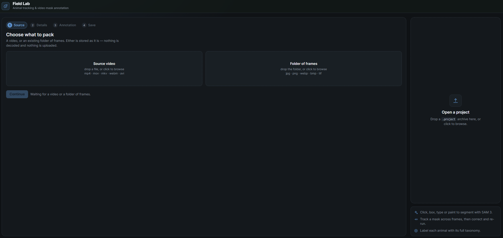

---

## 2. Before you start

You need two processes running:

1. **Backend** (frame preparation, SAM 3 and the tracker) — from `backend/`:

    ```bash
    uvicorn src.main:app --host 0.0.0.0 --port 8000
    ```

    With `sam3.enabled = true` in `backend/config/server.json`, SAM 3 and propagation are available; the model files load on first use.

2. **Frontend** — from `frontend/`:

    ```bash
    npm install
    npm run dev
    ```

    Open the printed URL (normally `http://localhost:5173`). The dev server proxies `/api` to the backend.

The tool rail reports the model state (**Model** / **Offline**). If it says _Offline_, clicking it re-checks; segmentation and tracking need it.

---

## Part A — Create a project (upload your data)

The left pane of the start screen is a four-step wizard. **Everything is packed in your browser** — your frames are not uploaded during creation.

### Step 1 — Source

Choose where the pixels come from. Two cards sit side by side:

- **A video file** — drop a single video (`.mp4`, `.mov`, `.m4v`, `.avi`, `.mkv`, `.webm`, `.mpg`, `.mpeg`), or click to browse. The browser reads its duration, size and frame rate.
- **A folder of frames** — drop a folder, or click to browse a directory (`jpg`, `png`, `webp`, `bmp`, `tif`). Frames are sorted in natural order so the first previewed frame is the first the reviewer sees.

Drop routing is by content: a single video lands as a video; anything else is treated as a folder of frames.

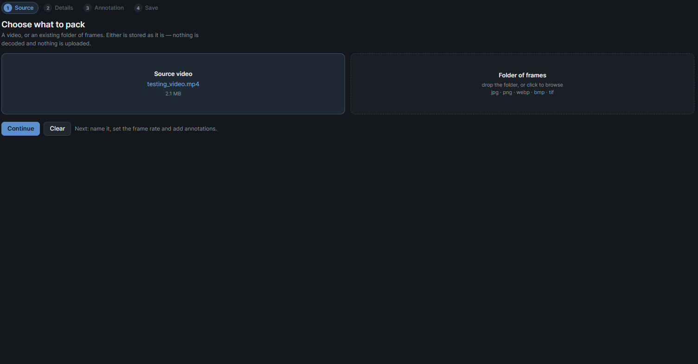
_Step 1: pick a video or a folder of frames._

### Step 2 — Details

- **Segmentation mode** (fixed at creation, cannot change later):
    - **Instance** — every tracked object gets its own tracklet with a per-frame mask; several tracklets may share a category.
    - **Semantic** — one mask sequence per category (currently _unavailable_ for new projects).
- **Project name** — used for the `.project` filename and shown in the header.

- **Frame rate** — use the **original** rate the browser measured, or **enter** one. A folder of frames has no measurable rate, so you must type it. The project is built for the rate shown underneath.

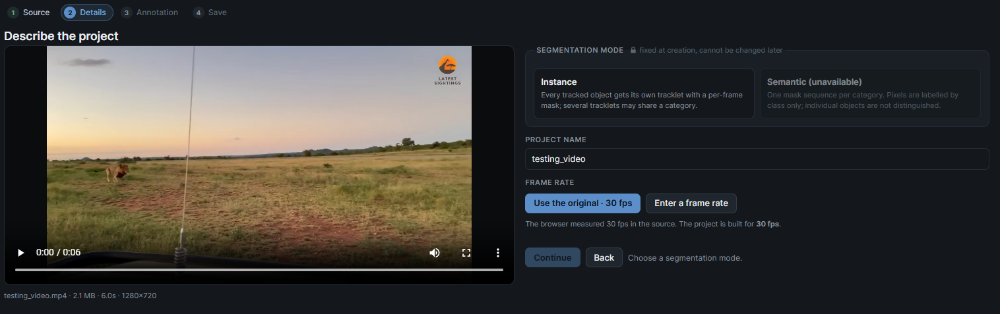
_Step 2: mode, name and frame rate._

### Step 3 — Annotation (optional)

You may seed the project from an existing **VideoSegmentation JSON** — its video record is completed to match the frames you selected. Skip it to start with an empty project (no tracklets).

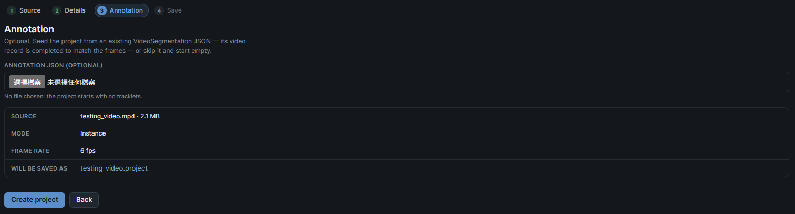
_Step 3: optionally seed the project from an annotation JSON._

### Step 4 — Save

Review the summary, then press **Create project**. The wizard packs the frames, the annotation and the metadata into one file and downloads **`<name>.project`**.

Put that file somewhere safe — it _is_ the project. From here you can either click **Open it in the reviewer** to start straight away, or **Create another project**.

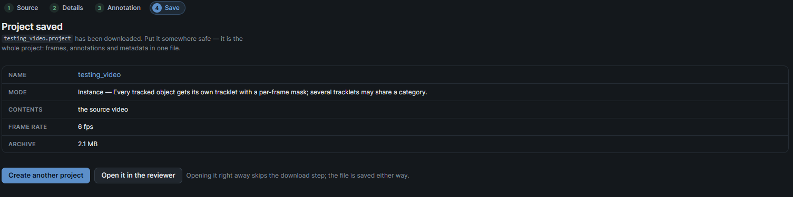
_Step 4: the project is packed and downloaded as a `.project` file._

---

## Part B — Open a project

Use the right pane of the start screen ("Open a project"):

- **Drag a `.project` archive** onto the drop zone, or **click to browse** and pick a `.project` / `.zip` file.

The archive is read in two places at once:

- the browser parses the annotation dataset locally, and
- the archive is uploaded **once** so the backend can materialise the frames — copying a frame folder, or decoding a video.

You will see **"Preparing frames and reading annotations…"** while this happens. If the frames the backend built do not match the list the archive recorded, a notice warns you to check the clip before annotating.

---

## Part C — The workspace at a glance

Once a project opens you get a single-screen workspace:

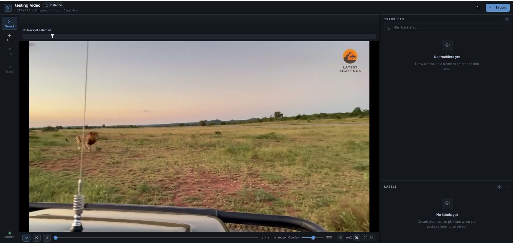
_The workspace: tool rail, video stage with timeline, and the two sidebar panels._

- **Header** — clip name, a mode chip (_Instance_ / _Semantic_), size in pixels, frame count, fps, object count, **Open another** (folder icon) and **Export**.
- **Tool rail** (far left) — one tool at a time: **Select**, **Add**, **Edit**, **Track**, plus the model status footer.
- **Video stage** (centre) — a tool-specific prompt bar on top, the **timeline**, and the **canvas** with zoom/pan, play, step and a mask-opacity slider.
- **Sidebar** (right) — the **objects list** on top and the **labels panel** below. Both are resizable by dragging the seams (double-click to reset).

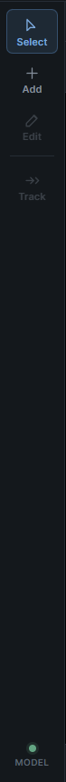
_The rail: Select (Esc) · Add (A) · Edit (E) · Track (T), and the model status._

---

## Part D — Draw masks (Add)

Press **A** (or click **Add**) to create a new object on the current frame. Pick a drawing method from the segmented control:

| Method            | How to use it                                                                                                           |
| ----------------- | ----------------------------------------------------------------------------------------------------------------------- |
| **SAM 3** (point) | Click the object. Shift-click to _exclude_ a region. Add more clicks to refine.                                         |
| **Box**           | Drag a box around the object.                                                                                           |
| **Text**          | Type a class name (e.g. `shark`) and press **Enter**. SAM 3 finds every match; each instance can become its own object. |
| **Polygon**       | Click vertices; close with **Enter**, a double-click, or right-click (needs ≥ 3 points).                                |
| **Brush**         | Drag to paint; **Shift-drag** (or right-drag) erases; **[** and **]** resize.                                           |

In **instance** mode the bar also has a **"Label for the new object"** dropdown — assign a label as you create it (or leave it unlabelled for now).

When you are happy, press the commit button (`Add as new tracklet`, or `Add to "<label>"` / `New class "…"` for semantic). The result is written as a one-frame mask; the bar stays open so you can create several objects in a row. Use **Clear** to discard everything pending on this frame.

> **Accept is the only writer.** Nothing reaches the clip until you commit. **Clear** throws away the pending draft, clicks and polygon; **Esc** leaves the tool (and does not discard).

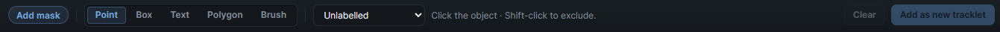
_The Add bar: method picker, label picker, Clear and the commit button._

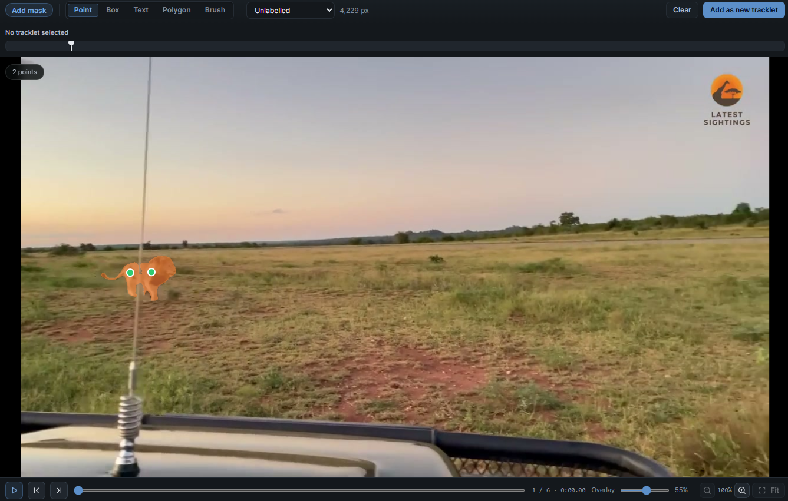
_Click a point (SAM 3) to segment an object._

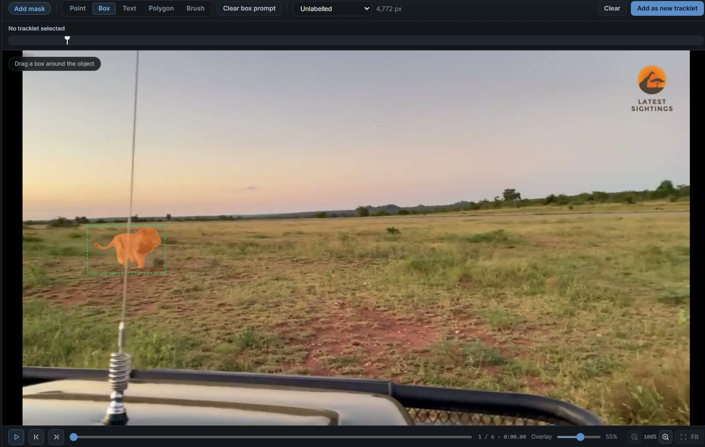
_Drag a box around the object._

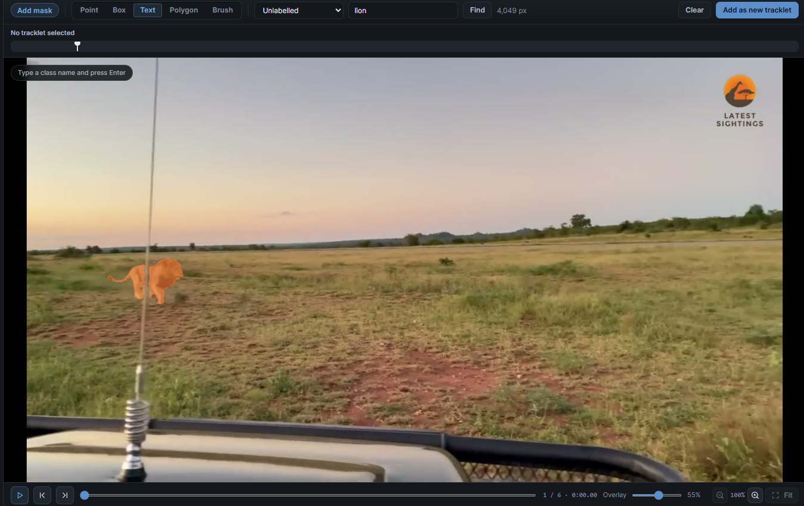
_A text prompt can return several instances._

<!-- SCREENSHOT 14 — Polygon drawing -->

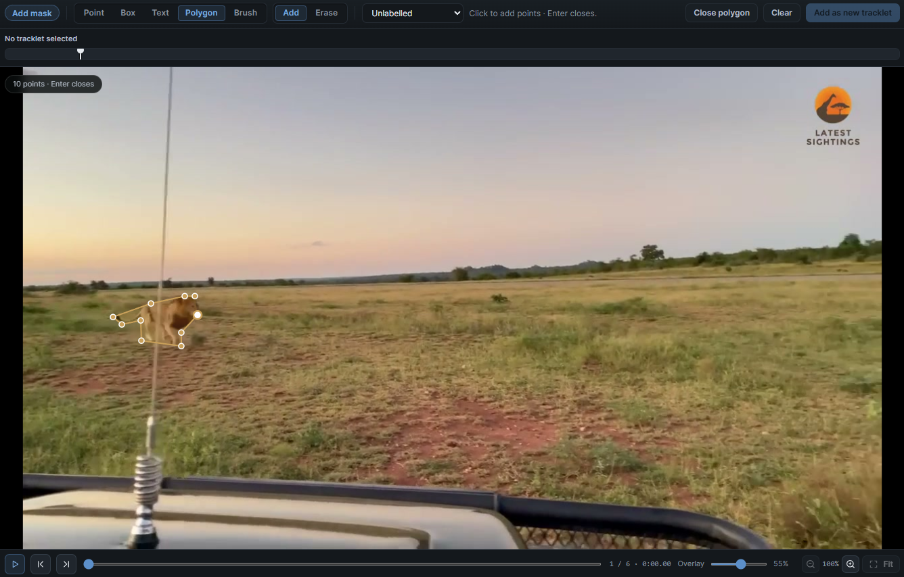
_Click vertices, then close the polygon with Enter._

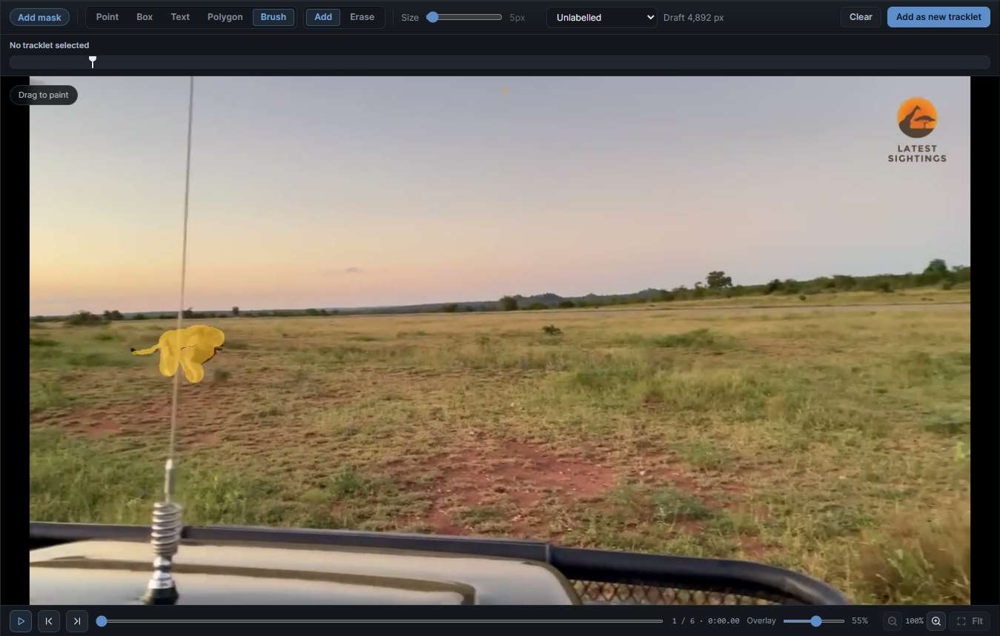
_Paint with the brush; Shift-drag erases._

---

## Part E — Correct masks (Edit)

Press **E** (or click **Edit**) with an object selected. What the bar offers depends on whether the object already has a mask on this frame:

- **Mask present** → correction methods only: **Polygon** and **Brush**.
    - **Polygon** switches to **outline editing**: drag a vertex to move it, drag an edge to insert a vertex, right-click a vertex to remove it.
    - **Brush** paints/erases on the existing mask.
    - **Save mask** commits the correction.
- **No mask here** → the create methods (**SAM 3**, **Box**, **Text**) return, so a redraw fills _this object's_ frame instead of making a second object.

**Delete mask on this frame** clears the frame in place (or deletes the object if that was its only mask). The single recovery button **Clear** discards the pending edit; **Backspace** undoes and **Esc** leaves the tool.

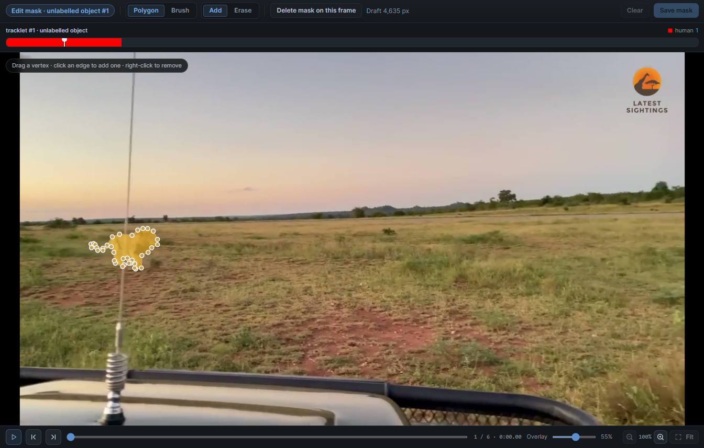
_Edit mask: correct with polygon outline editing or the brush._

---

## Part F — Labels & taxonomy

A **label** is a class shared by any number of objects. The sidebar has two panels:

- **Objects** (top) — every tracklet, searchable by label, id or object id. Each row shows a colour block (its label) with the label id, the object name, and a trash button on hover. Click the colour block to open the **label picker**: choose a label, pick **no label** (red "–"), or **create** a new label.
- **Labels** (bottom) — one row per label with how many objects use it. Use the **+** to create a label, the pencil to edit, and the trash to delete (its objects fall back to _unlabelled_).

The **label editor** holds the name (which is the **common name** the label is saved and exported under), a colour, and the full taxonomy: **Kingdom, Phylum, Class, Order, Family, Genus, Species**. Higher ranks offer **GBIF autocomplete** — pick a suggestion to fill in the rest of the lineage.

Conventions worth knowing:

- Objects are coloured **by label**. **Unlabelled** objects are red.
- The label list order _is_ the id order (the number on the colour block).
- Deleting a label renumbers the ones after it; its objects become unlabelled.

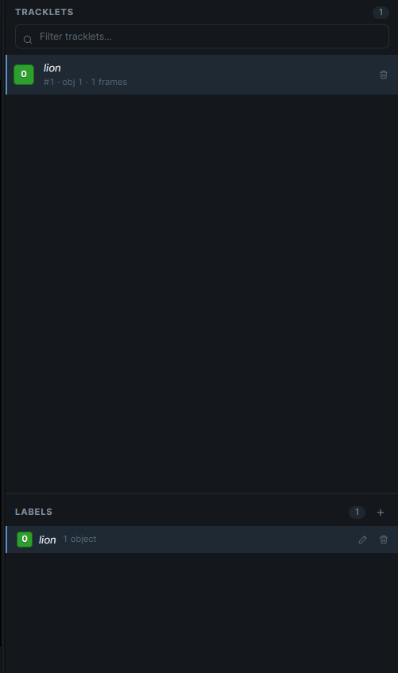
_The objects list: filter, select, assign a label, delete._

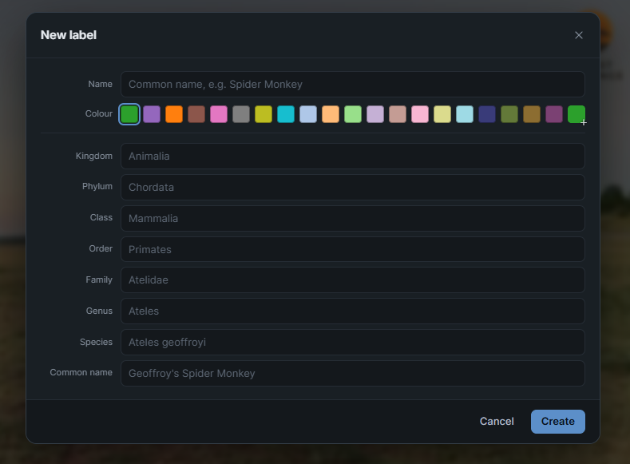
_The label editor: name, colour and the full taxonomy with GBIF autocomplete._

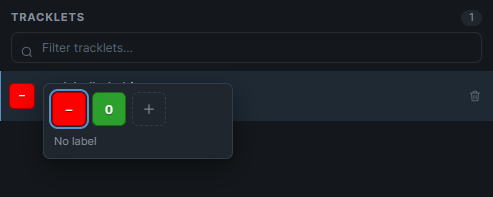
_Assign a label from a row's colour block._

---

## Part G — Track a mask across frames (Propagate)

Press **T** (or click **Track**) to carry a mask across the clip with SAM 3's video predictor.

1. **Start from a human frame.** The anchor must be a frame you drew or corrected — its timeline cell is in the object's colour. The Track button is enabled only for such a frame.
2. **Set the range** by dragging the two bars on the timeline. The run covers the frames between them _and_ walks both ways around the anchor.
3. **(Optional) queue several objects.** Shift-click rows in the objects list to add them to the queue; each becomes its own job, run one at a time.
4. Press **Propagate** (**Enter**). Masks **stream in** and play back at the clip's frame rate. The **queue** shows each run's state, progress and how many frames it produced.
5. **Review.** Step through the produced frames; the timeline marks them orange (machine output) versus the object's colour (your corrections). You can **Stop** a run at any time; frames already produced stay.
6. **Keep them by leaving the tool.** Switching back to Select (or selecting a different object) accepts the run — there is no separate Accept button. Correct any frame by hand, then re-run: your corrections seed the next run.

> While a run is live the keyboard belongs to the run and the rail is locked; only **Stop** works.

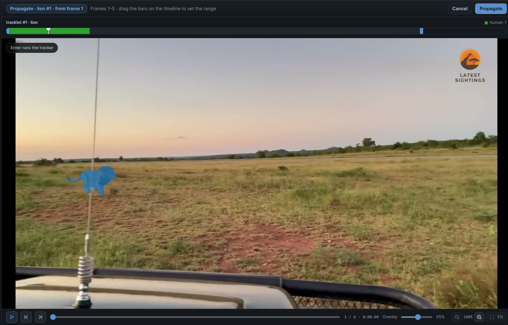
_Set the range on the timeline, then Propagate._

---

## Part H — Review, play & navigate

- **Play / pause** — the video control or **Space**.
- **Step a frame** — the ⏮ / ⏭ buttons or **←** / **→**.
- **Timeline** — click to seek. Cells read:
    - **object colour** = a frame a human drew or corrected,
    - **orange** = a machine-propagated frame,
    - **background** = no mask (the tracker found nothing).
- **Zoom / pan** — scroll to zoom, middle-drag to pan, and the _Fit_ button to reset.
- **Mask opacity** — the slider under the canvas.
- **Panels** — drag the seams to resize the video stage, the objects list and the label list; double-click a seam to reset.

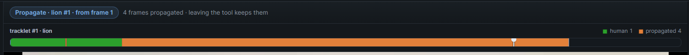
_The timeline distinguishes human frames, propagated frames and empty frames._

**Note, user can further refine the mask by editing the propagated masks to enhance the propagation quality**

---

## Part I — Export the annotations

Press **Export** in the header. The chooser lists what this project can hand back (some entries are disabled if the archive did not carry that data):

| Option                      | File                        | When                                                                                            |
| --------------------------- | --------------------------- | ----------------------------------------------------------------------------------------------- |
| **Original video**          | `<name>.<ext>`              | The project was packed from a video (copied out unrecompressed).                                |
| **Original frames**         | `<name>_frames.zip`         | The project was packed from a frame folder.                                                     |
| **Sampled frames**          | `<name>_sampled_frames.zip` | The frames this review actually annotated.                                                      |
| **Annotation JSON**         | `<name>_annotation.json`    | Instance projects: the dataset as it stands, one entry per object with its per-frame RLE masks. |
| **Updated project archive** | `<name>.project`            | Semantic projects: frames + label maps + annotation, reopenable to carry on.                    |

Every file is written in the browser — nothing is uploaded, and the export needs no round trip to the backend. Large multi-file exports show progress (`12 / 340 frames`) and keep the dialog open until the download starts.

<!-- SCREENSHOT 24 — Export dialog -->

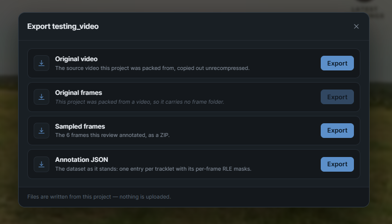
_The export chooser: pick the artifact you need._

---

## Keyboard shortcuts

| Key         | Action                                                        |
| ----------- | ------------------------------------------------------------- |
| `Space`     | Play / pause                                                  |
| `←` / `→`   | Step one frame back / forward                                 |
| `A`         | Add-mask tool (toggles)                                       |
| `E`         | Edit-mask tool (needs a selected object)                      |
| `T`         | Track tool (needs a human mask on this frame)                 |
| `Esc`       | Leave the current tool → Select                               |
| `Enter`     | Commit a mask / run or accept a propagation / close a polygon |
| `Backspace` | Undo the pending edit                                         |
| `S`         | Draw method: **SAM 3** (point)                                |
| `P`         | Draw method: **Polygon**                                      |
| `B`         | Draw method: **Brush**                                        |
| `[` / `]`   | Brush size down / up                                          |

> Shortcuts are ignored while typing in an input, select or textarea, while the export dialog is open, and while a propagation run is live.

---

## Troubleshooting

| Symptom                                | Likely cause / fix                                                                                                                           |
| -------------------------------------- | -------------------------------------------------------------------------------------------------------------------------------------------- |
| Tool rail says **Offline**             | The backend is not reachable or SAM 3 is disabled. Start the backend and click the status to re-check.                                       |
| **"Preparing frames…"** never finishes | The backend could not decode the video (unsupported container) or the archive is not a supported ZIP (must be STORED or DEFLATE).            |
| A notice about mismatched frame names  | The frames the backend built differ from the archive's recorded list. Masks are addressed by frame position — check before annotating.       |
| **Add**/**Edit** commits nothing       | You have no pending mask. Commit is disabled until a SAM 3 candidate, polygon, brush stroke or edit exists.                                  |
| **Track** is greyed out                | The current frame is not human input for the selected object. Step to a frame you drew/corrected (its timeline cell is the object's colour). |
| A frame shows **"Frame unavailable"**  | That frame is missing from the session; the rest of the clip still works.                                                                    |
| Semantic mode is greyed out            | Semantically-created projects are temporarily locked; existing semantic projects still open.                                                 |
